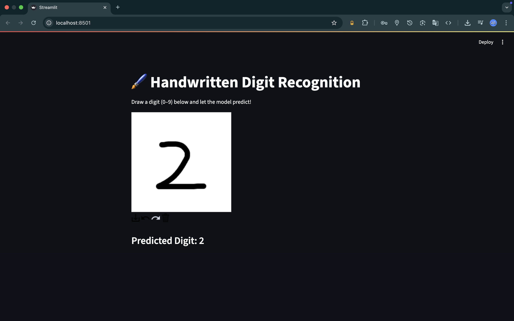
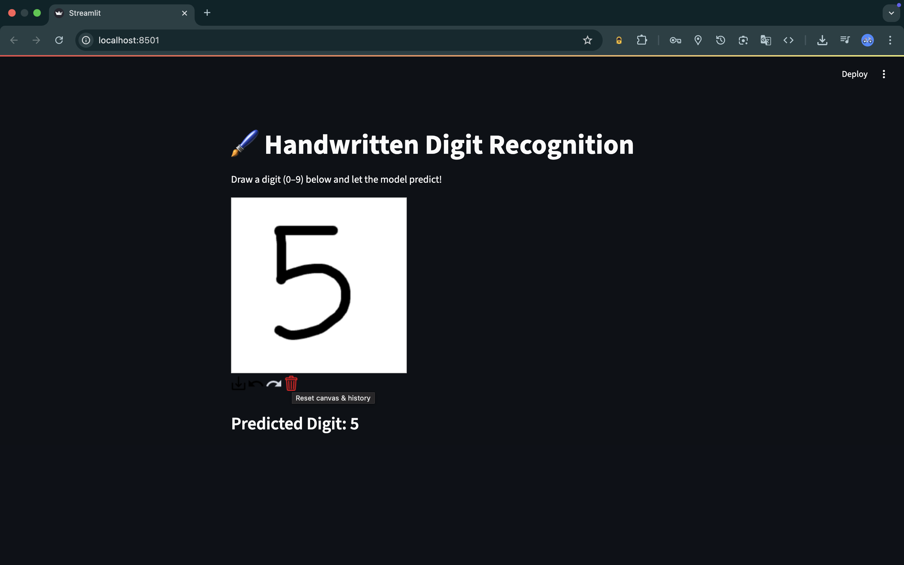

# 🖌️ Handwritten Digit Recognition with CNN

This project is a **Convolutional Neural Network (CNN) application** that recognizes handwritten digits (0–9) from user drawings, using the **MNIST dataset**. Users can draw digits in a browser and get real-time predictions.

---

## 🚀 Features
- Predict handwritten digits from a **drawing canvas**.
- Built using **TensorFlow/Keras** for CNN.
- Frontend created with **Streamlit** for interactive UI.
- Supports drawing, prediction, and confidence display.

---

## 📊 Model Performance
| Model       | Test Accuracy |
|------------|---------------|
| Perceptron | 90.77%        |
| ANN        | 97.53%        |
| CNN        | 98.95%        |

*CNN achieves the highest accuracy on MNIST.*

---

## 🛠️ Technologies Used
- **Python 3.x**
- **TensorFlow / Keras**
- **Streamlit**
- **OpenCV**
- **streamlit-drawable-canvas**
- **NumPy / Pandas / Matplotlib / Seaborn**

---

## 📂 Project Structure

- `dataset` → Datasets used for training/testing  
- `images` → Output of the project  
- `app.py` → Main application script  
- `model.keras` → Trained Keras model file  
- `notebook.ipynb` → Collab notebook for exploration, training & analysis  
- `requirements.txt` → Python dependencies  
- `LICENSE` → Project license  

---

## ⚙️ Installation & Setup
1. Clone the repo:
   ```bash
   git clone https://github.com/adars-h-agrawal/digit-recognition-cnn-model.git
   cd digit-recognition-cnn-model

2. (Optional) Create a virtual environment:
   ```bash
   python3 -m venv cnn_env
   source cnn_env/bin/activate    # macOS/Linux
   cnn_env\Scripts\activate       # Windows
3. Install dependencies:
   ```bash
   pip install -r requirements.txt
4. Run the Streamlit app:
   ```bash
   streamlit run app.py

---

## 🖼️ Demo

###  Home Page


###  Prediction Output


---

**Author**: Adarsh Agrawal

---

## 📜 License

This project is licensed under the MIT License — see the [LICENSE](LICENSE) file for details.
